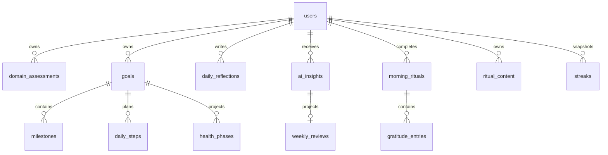

# Database Architecture Audit

## Executive summary

The domain model is fundamentally sound: goals, milestones, daily steps, domain assessments, reflections, rituals, gratitude entries, and AI insights have different lifecycles and should remain separate tables.

The main structural gap was integrity enforcement in local SQLite. `foreign_keys = ON` was enabled, but the schema did not define foreign keys. The local schema now adds native foreign keys for new databases and equivalent relationship guards plus cascade cleanup triggers for existing files.

The repository also contained single-user shortcuts. Product-facing API queries and mutations are now scoped to the authenticated local user.

SQLite is the only persistent product-data store. Browser storage is limited to
temporary drafts and interface preferences.

## Relationship map

## Changes applied

- Added foreign keys with cascade behavior for new SQLite databases.
- Added compatibility triggers for relationship validation and cascade cleanup in existing SQLite files.
- Added placeholder `users` rows automatically for local-first writes that occur before profile setup.
- Added indexes for ritual history, gratitude children, goal status feeds, milestone order, goal-step lookups, health phase uniqueness, and insight timelines.
- Replaced goal `INSERT OR REPLACE` with `ON CONFLICT DO UPDATE`; `REPLACE` can delete child rows when cascades are active.
- Scoped repository reads and ID-based mutations by `user_id`.
- Removed the `|| true` single-user shortcuts from generation context.
- Restricted generated daily-step context to active goals.
- Centralized `weekly_reviews` projection updates so local creation and legacy-import writes stay consistent.
- Aligned local columns and hot-path indexes with the active product model.
- Added automatic SQLite persistence for check-ins and user-managed ritual content.

## Keep separate

| Tables | Decision |
| --- | --- |
| `goals`, `milestones`, `daily_steps` | Keep separate. They have 1:N relationships, different lifecycles, and different query patterns. |
| `morning_rituals`, `gratitude_entries` | Keep separate. Gratitude entries are repeated children and are useful for longitudinal analysis. |
| `domain_assessments`, `daily_reflections`, `checkins` | Keep separate. They represent baseline state, end-of-day adaptation, and momentary state reads. |
| `ai_insights`, `streaks` | Keep separate. Insights are generated content; streaks are optional metric snapshots. |

## Intentional projections and JSON

| Fields or tables | Decision |
| --- | --- |
| `goals.health_context_json` plus flattened health columns | Keep temporarily as canonical snapshot plus analytics projection. Rebuild flattened values from JSON during migrations. |
| `morning_rituals.session_json` plus flattened ritual columns | Keep temporarily as canonical session snapshot plus admin/reporting projection. |
| `checkins.entry_json` plus flattened check-in columns | Keep as canonical UI payload plus analytics projection. |
| `health_phases` | Treat as a rebuildable projection of goal health context. Keep only if phase-level reporting or indexed lookup is used. |
| `weekly_reviews` | Treat as a rebuildable projection of `ai_insights.metadata`. Prefer a SQL view in production unless measured query volume justifies materialization. |
| JSON arrays such as `main_blockers`, `selected_tags`, and `domain_progress` | Keep as JSON while they are read as a whole and not independently filtered. |

## Recommended next migrations

1. Replace ad-hoc `ALTER TABLE` try/catch migrations with a `schema_migrations` table and ordered versioned migrations.
2. Normalize `checkins.follow_ups` into `checkin_follow_ups` when follow-up responses become queryable product data.
3. Remove `streaks` until a scheduled snapshot writer exists, or add the writer and retention policy.
4. Replace physical `weekly_reviews` with a view if reporting benchmarks do not justify storage duplication.
5. Add production deletion/export workflows and retention rules for sensitive text.

## Existing local database verification

The migrated local database contained `5` goals, `8` milestones, `32` daily steps, and `10` health phases. Integrity checks found no orphaned goal, ritual, or projection children and no cross-user child mismatches.
